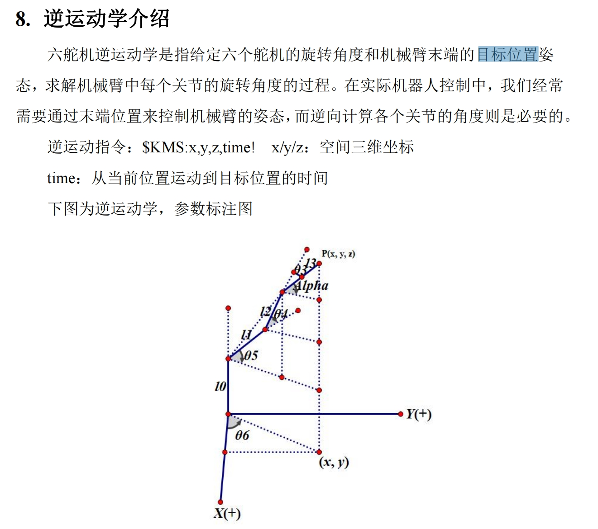
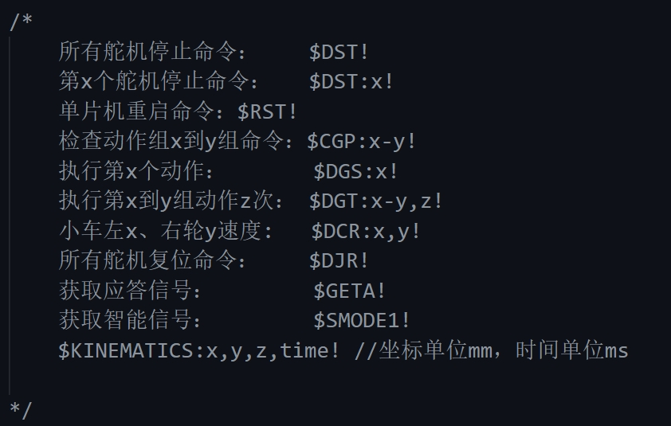

# Progress

## Week 1

### 2 July

- 确定了题目，识别 EEG 和 EOG ，用以控制机械手臂
- 实操了脑电帽，完成了离线的数据读取（数据是在读入完成后传输到电脑上的）

### 3 July

> 计划：
>
> - [X] 完成在线数据读取（在 cqy 电脑上配环境，看一眼 GPT ），写一个程序能实时接收电信号，并根据电信号做出决策
> - [X] 完成机械手的简单控制操作
> - [X] EEG & EOG introduction slides
> - [X] 瞅一眼OpenBCI 公开数据集
>
> Q:
>
> - Difference among Cyton, Daisy, Ganglion, Wife Shield. Which is our device (Cyton 还是 Cyton + Daisy)?
> - Electrode and Channel: EEG 的原理是什么，我们的设备的 electrode 和 channel
> - 设备的 port 是什么 (COM5)？

- Python env: https://docs.openbci.com/Deprecated/Python/
- Public OpenBCI Dataset: https://openbci.com/community/publicly-available-eeg-datasets/

  我下载了：

  - EEG Motor Movement/Imagery Dataset: https://www.physionet.org/content/eegmmidb/1.0.0/
- OpenBCI-Stream: https://openbci-stream.readthedocs.io/en/latest/

  环境配置 & 说明文档：https://pypi.org/project/openbci-stream/
- EEG 实时监测：https://github.com/AITRICS/EEG_real_time_seizure_detection
- EEG 去除眼动伪影（可以考虑反向一下，如何识别眼动伪影）：https://www.x-mol.com/paper/1651263943939469312/t?recommendPaper=1368377261352968192
- 16 通道脑电帽的文件读取：https://github.com/EmilioGarzia/EEG_ECG-Reader-ULTRACORTEX-MarkIV-

## Week 2

- 解决了实时通讯问题，现在可以用 Python code 实时传输信号，让机械臂的指定舵机移动到指定位置
- 在用 Python 数据读取的时候遇到了很大问题，问题大概是这个：https://openbci.com/forum/index.php?p=/discussion/740/how-get-the-value-in-uv

  解决方案有可能是：
- 跟李宗钰学长联系，存在一种方式是向指定位置移动的：

  

  指令如下：

  

* 信号处理：https://chatgpt.com/share/75b0b868-035e-4dc2-9e4d-d7ef3777772e
* 

111：

1. https://blog.csdn.net/qq_38424674/article/details/109386298
1. https://zhanghuan95.github.io/2020/04/09/OpenBCI/
1. **https://docs.openbci.com/Examples/ExamplesLanding/**
1. https://github.com/WATOLINK/mind-speech-interface-ssvep
